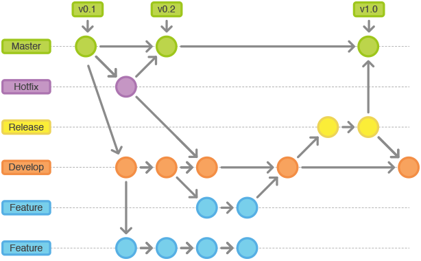

# Metodologia

Pré-requisitos: <a href="https://github.com/ICEI-PUC-Minas-PMV-ADS/pmv-ads-2021-2-e1-proj-web-t4-projeto-mundo-sem-fronteiras/blob/main/docs/02-Especificação%20do%20Projeto.md"> Documentação de Especificação</a>

A metodologia contempla as definições de ferramental utilizado pela equipe tanto para a manutenção dos códigos e demais artefatos quanto para a organização do time na execução das tarefas do projeto.

Os artefatos do projeto são desenvolvidos a partir de diversas plataformas e a relação dos ambientes com seu respectivo propósito é apresentada na tabela que se segue.

| Ambiente | Plataforma |
|:--------:|:----------:|
| Repositório de código fonte | GitHub |
| Documentos do projeto | GitHub |
| Projeto de interface e wireframes | Figma |
| Gerenciamento do projeto | GitHub |

## Gestão de Código Fonte

Para gestão do código fonte do software desenvolvido pela equipe, o grupo utiliza um processo baseado no Git Flow abordado por Vietro (2015), mostrado na Figura a seguir. Desta forma, todas as manutenções no código são realizadas em branches separados, identificados como Hotfix, Release, Develop e Feature. Uma explicação rápida sobre este processo é apresentada no vídeo "[The gitflow workflow - in less than 5 mins](https://www.youtube.com/watch?v=1SXpE08hvGs)".

- `“Hotfix”` ou “maintenance branch: usado para correções rápidas de erros;
- `Release` branch: é a branch para entrega, desenvolvida quando as funcionalidades do ciclo estão prontas. Deve ser integrada com as branches Master e Develop;
- `Develop`: é o branch principal para o desenvolvimento, também utilizado para guardar o histórico do projeto. É neste branch que são integradas todas as novas funcionalidades (feature branches);
- `Feature` branch: ao iniciar o desenvolvimento de uma nova funcionalidade, esta deve ter seu próprio branch que, posteriormente, serão integradas no branch develop.

## Controle de Versão

A ferramenta de controle de versão utilizada será o Git. Para hospedagem do repositório, será utilizado o GitHub.

O projeto segue a seguinte convenção para o nome de branches:

- `main`: versão estável já testada do software
- `unstable`: versão já testada do software, porém instável
- `testing`: versão em testes do software
- `dev`: versão de desenvolvimento do software

Quanto à gerência de issues, o projeto adota a seguinte convenção para
etiquetas:

- `documentation`: melhorias ou acréscimos à documentação
- `bug`: uma funcionalidade encontra-se com problemas
- `enhancement`: uma funcionalidade precisa ser melhorada
- `feature`: uma nova funcionalidade precisa ser introduzida

## Gerenciamento de Projeto

A equipe utiliza metodologias ágeis, tendo escolhido o Scrum como base para definição do processo de desenvolvimento.

A divisão da equipe foi realizada da seguinte maneira:
<ul>
 <li>Scrum Master: Matheus Mendes Fonseca</li>
 <li>Product Owner:
  <ul>
   <li>Matheus Mendes Fonseca</li>
   <li>Tiago Miquéias Viana Rodrigues</li>
  </ul>
 </li>
 <li>Equipe de Desenvolvimento:
  <ul>
   <li>Arthur Moreira de Morais</li>
   <li>Jéssica Raíssa Araújo Oliveira Queiroz Lopes</li>
   <li>Neemias Junio Anjos Lopes</li>
   <li>Victor Bruno Kulessa</li>
  </ul>
 </li>
 <li>Equipe de Design:
  <ul>
   <li>Neemias Junio Anjos Lopes</li>
   <li>Tiago Miquéias Viana Rodrigues</li>
   <li>Victor Bruno Kulessa</li>
  </ul>
 </li>
</ul>

Para gerir o andamento do projeto, foi utilizado o recurso de <a href="https://github.com/ICEI-PUC-Minas-PMV-ADS/pmv-ads-2021-2-e1-proj-web-t4-projeto-mundo-sem-fronteiras/projects/1#card-70838916">Projetos</a> do GitHub. Deste modo, tanto do Backlog do Produto quanto o andamento das atividades no decorrer das Sprints serão mostrados de forma detalhada, descrevendo o que foi feito, o que está em andamento e o que está pendente.

### Ferramentas

As ferramentas empregadas no projeto são:

<ul>
 <li>Editor de texto: Visual Studio Code</li>
 <li>Ferramentas de comunicação:
  <ul>
   <li>WhatsApp</li>
   <li>Discord</li>
  </ul>
 </li>
 <li>Ferramentas de desenho de tela: Figma</li>
 </ul>

O Visual Studio Code foi escolhido por ser uma solução gratuita, leve e versátil, além de possuir integração com o GitHub e GitHub Desktop, o que facilita o controle de versões e a gestão das branches. As ferramentas de comunicação citadas foram escolhidas pelo dinamismo e facilidade de utilização, agilizando o contato entre os integrantes do projeto. Para criar as telas, o Figma foi escolhido devido à simplicidade de uso e flexilidade, podendo ser usado tanto na web quanto instalado no sistema.
