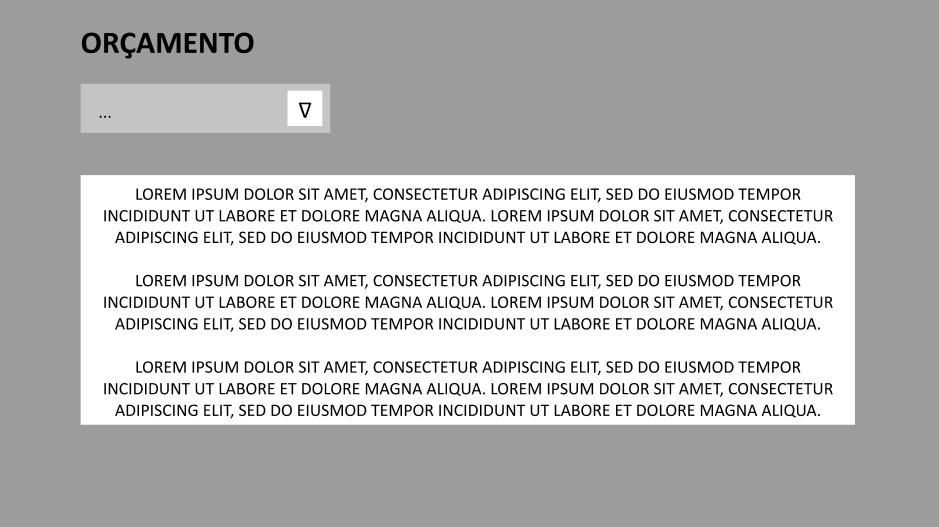

# Projeto de Interface

Pré-requisitos: <a href="https://github.com/ICEI-PUC-Minas-PMV-ADS/pmv-ads-2021-2-e1-proj-web-t4-projeto-mundo-sem-fronteiras/blob/main/docs/02-Especificação%20do%20Projeto.md"> Documentação de Especificação</a>

Dentre as preocupações para a montagem da interface do sistema, estamos estabelecendo foco em questões como agilidade, acessibilidade e usabilidade. Desta forma, o projeto tem uma identidade visual padronizada em todas as telas que são projetadas para funcionamento em desktops e dispositivos móveis.

## Fluxo do Usuário

O diagrama apresentado na figura abaixo mostra o fluxo de interação do usuário pelas telas do sistema. Cada uma das telas deste fluxo é detalhada na seção de Wireframes que se segue. Para uma visualização completa, acesse o [link do projeto no Figma](https://www.figma.com/file/y9jcqeyo9vRPt3E7A0Ihbt/MundoSemFronteiras?node-id=0%3A1).

## Wireframes

Conforme fluxo de telas do projeto, apresentado no item anterior, as telas do sistema são apresentadas em detalhes nos itens que se seguem. 

### Tela - Home 

A tela Home se inicia interagindo com o usuário, representando a logo (parte da identidade visual do projeto) e um setor de busca onde o usuário poderá digitar o país, o qual busca informações e será direcionado para a página solicitada. 

  
### Tela - Home - Barra de Navegação

Ao optar por continuar na página Home, assim que o usuário rolar a página para baixo, será exibida uma barra de navegação fixa até o final do site, conforme a imagem abaixo. A interação com essa barra de resume em ir direto aos tópicos “Sobre”, “Diferenciais” e “Contato” localizados na mesma página, ou voltar à tela inicial de busca ao clicar na logo do site.

  
### Tela - Home - Sobre e Diferenciais

Ao seguir pela página, o usuário irá visualizar a guia “Sobre Nós”, onde poderá ler um pouco sobre a nossa história e sobre o projeto. Conforme a imagem abaixo: 

 

Prosseguindo pela página inicial o usuário deparará com a guia de “Diferenciais”, onde falaremos resumidamente sobre como iremos trazer informações atualizadas para o usuário.

  
### Tela - Home - Rodapé 

Nessa seção da página home, permite-se ao usuário enviar mensagem direta para a equipe de comunicação e alimentação de dados. Essa tela permite que o usuário insira seu nome e e-mail, o que facilitará o retorno de informações pela equipe. 

É neste campo também que se encontram os dados gerais da sede do projeto, com: e-mail, telefone, endereço.

  
### Tela - País 

Ao selecionar um país no início da tela Home, o usuário será direcionado à página referente ao país da busca, onde visualizará uma foto da bandeira do país e uma breve descrição sobre o mesmo. 

  
### Tela - País - Documentação 

O primeiro dado que o usuário terá contato será o de “Documentação”, onde poderá consultar quais são os documentos necessários para entrada naquele país procurado, e obter todas as informações relacionadas à obtenção dos mesmos.

  
### Tela - País - Recomendações e Orçamento 

Após a documentação, o usuário terá acesso a algumas recomendações de lugares ou opções de lazer no país de interesse, desde cidades famosas até monumentos históricos. Serão selecionadas as opções mais buscadas pelos viajantes e estas serão mostradas aqui.

Ao final da página, o usuário terá duas opções de orçamentos: para uma semana e para um mês. Os valores mostrados serão calculados com foco no custo-benefício, ou seja, serão baseados nos gastos essenciais para suprir alimentação, transporte e acomodação e passar determinado tempo naquele país sem demais dificuldades. Com base nesses valores aproximados, o usuário poderá ter uma noção ou média, de quanto precisará gastar para aproveitar sua viagem e se programar para ficar mais tempo, caso necessário.

