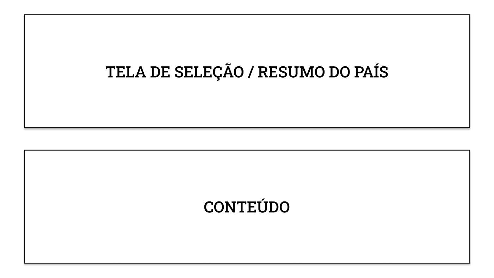
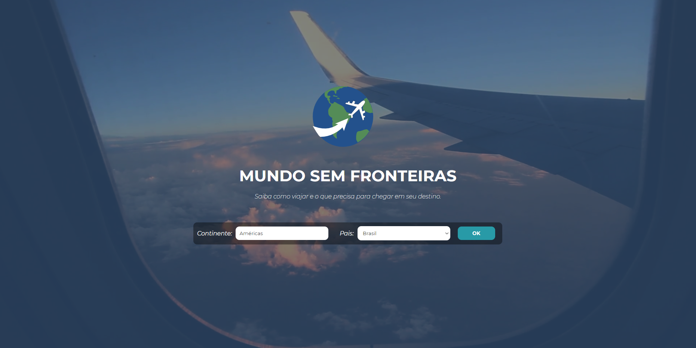
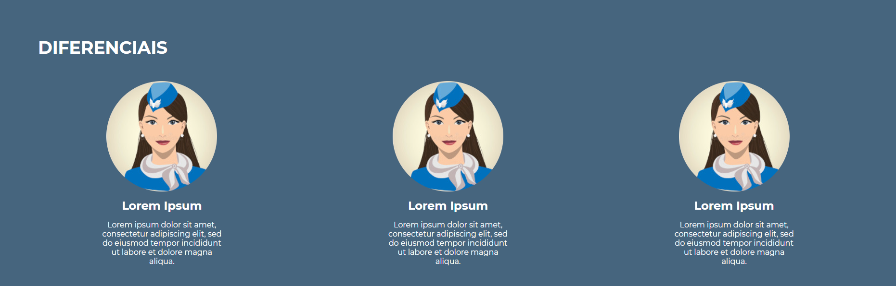
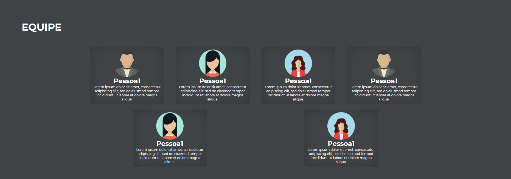
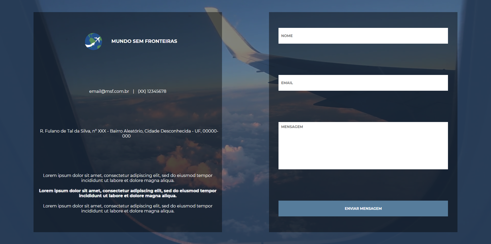

# Template Padrão do Site

Pré-requisitos: <a href="2-Especificação do Projeto.md"> Especificação do Projeto</a>, <a href="3-Projeto de Interface.md"> Projeto de Interface</a>, <a href="4-Metodologia.md"> Metodologia</a>

O padrão de layout a ser utilizado pelo site tem correspondência ao projeto de Interface elaborado anteriormente.

## Tela principal

Ao entrar no site, a primeira ação do usuário será escolher o continente e, logo após, o país de destino. Após a seleção, o mesmo será direcionado à página contendo todas as informações relaciondas ao país selecionado.

## Diferenciais

## Equipe

Descrição dos membros da equipe, tais como suas funções e link das redes sociais.

## Footer

Informações de contato e endereço, além de uma caixa de mensagens para envio de sugestões e/ou dúvidas.

