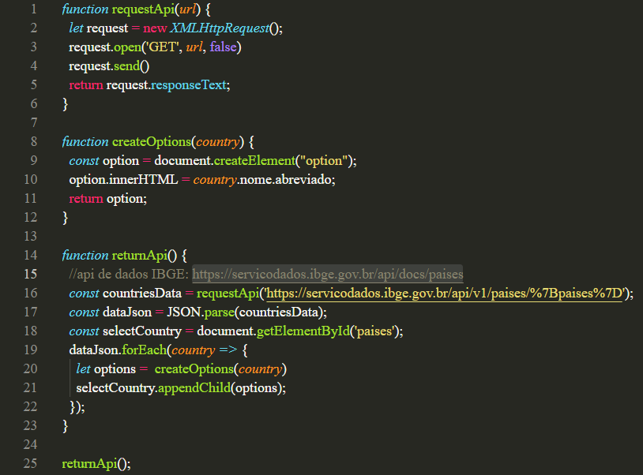

# Funcionalidades do Sistema

Pré-requisitos: <a href="2-Especificação do Projeto.md"> Especificação do Projeto</a>, <a href="3-Projeto de Interface.md"> Projeto de Interface</a>, <a href="4-Metodologia.md"> Metodologia</a>, <a href="3-Projeto de Interface.md"> Projeto de Interface</a>, <a href="5-Arquitetura da Solução.md"> Arquitetura da Solução</a>

Nesta seção são apresentadas as telas desenvolvidas para cada uma das funcionalidades do sistema. O respectivo endereço (URL) e outras orientações de acesso são apresentadas na sequência.

## Seleção do País (RF-01)

A tela principal apresenta duas caixas de seleção, uma para o Continente, e outra para o País. A lista com o nome dos países está armazenada na web e foi puxada para o site via [API](https://servicodados.ibge.gov.br/api/docs/paises) do site do IBGE.

### Requisitos Atendidos
<ul><li>RF-01 - Apresentar na página principal uma lista com os países para seleção</li></ul>

### Artefatos da Funcionalidade
<ul>
  <li>index.html</li>
  <li>header.css</li>
  <li>style.css</li>
  <li>script.js</li>
</ul>

### Estrutura de Dados

### Instruções de Acesso
<ol>
  <li>Faça o download do arquivo do projeto (ZIP) ou clone do projeto no GitHub;</li>
  <li>Descompacte o arquivo em uma pasta específica;</li>
  <li>Abra o Visual Studio Code e execute o Live Server;</li>
  <li>Abra um navegador de Internet e informe a seguinte URL: http://localhost:5500/src/index.html</li>
</ol>
