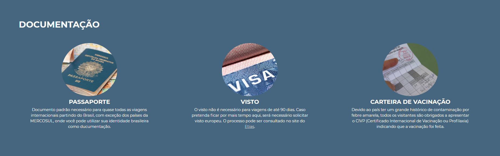

# Funcionalidades do Sistema

Pré-requisitos: <a href="2-Especificação do Projeto.md"> Especificação do Projeto</a>, <a href="3-Projeto de Interface.md"> Projeto de Interface</a>, <a href="4-Metodologia.md"> Metodologia</a>, <a href="3-Projeto de Interface.md"> Projeto de Interface</a>, <a href="5-Arquitetura da Solução.md"> Arquitetura da Solução</a>

Nesta seção são apresentadas as telas desenvolvidas para cada uma das funcionalidades do sistema. O respectivo endereço (URL) e outras orientações de acesso são apresentadas na sequência.

## Seleção do país (RF-01)

A tela principal apresenta uma lista com os país dos quais temos informações sobre. Basta o usuário selecionar a bandeira desejada que será direcionado à página contendo as informações daquele país.

### Requisitos Atendidos
<ul>
  <li>RF-01 - Apresentar na página principal uma lista com os países para seleção</li>
</ul>

### Artefatos da Funcionalidade
<ul>
  <li>index.html</li>
  <li>header.css</li>
  <li>section__container.css</li>
  <li>style.css</li>
</ul>

## Resumo e imagem do país selecionado (RF-02 e RF-03)

Ao ser direcionado à tela do país, o usuário encontrará no começo da página um breve resumo, contendo informações histórias e/ou culturais do país. Ao lado, verá a bandeira do país correspondente.

### Requisitos Atendidos
<ul>
  <li>RF-02 - Apresentar, para cada destino ou tópico, uma imagem correspondente ao país apresentado</li>
  <li>RF-03 - Permitir ao usuário visualizar um breve resumo ao entrar na página do país selecionado</li>
</ul>

### Artefatos da Funcionalidade
<ul>
  <li>malta.html</li>
  <li>header.css</li>
  <li>section__container.css</li>
  <li>style.css</li>
</ul>

## Recomendações de passeios e/ou pontos turísticos (RF-04)

Ao navegar pela página, o usuário irá encontrar uma sessão contendo recomendações de lugares para visitar naquele país, junto com uma breve descrição do ponto turístico que está vendo.

### Requisitos Atendidos
<ul>
  <li>RF-04 - Mostrar ao usuário sugestões de destino e entretenimento para o determinado país</li>
</ul>

### Artefatos da Funcionalidade
<ul>
  <li>malta.html</li>
  <li>recomendacoes.css</li>
  <li>section__container.css</li>
  <li>style.css</li>
</ul>

## Informações de contato (RF-05)

No footer da tela home, o usuário encontrará as informações de contato da equipe.

### Requisitos Atendidos
<ul>
  <li>RF-05 - Permitir visualizar as informações de contatos dos mantenedores do site</li>
</ul>

### Artefatos da Funcionalidade
<ul>
  <li>index.html</li>
  <li>footer.css</li>
  <li>section__container.css</li>
  <li>style.css</li>
</ul>

## Sessão de comentários e compartilhamento (RF-06, RF-07 e RF-08)

Na última sessão das telas de países, o usuário visualizará uma sessão de comentários do Facebook, além de dois botões, um para compartilhar e outro para curtir.

### Requisitos Atendidos
<ul>
  <li>RF-06 -	Permitir o compartilhamento das páginas visualizadas em redes sociais</li>
  <li>RF-07 -	Permitir que usuários possam comentar as postagens</li>
  <li>RF-08	- Exibir os comentários registrados em cada página de conteúdo</li>
</ul>

### Artefatos da Funcionalidade
<ul>
  <li>malta.html</li>
  <li>comments.css</li>
  <li>section__container.css</li>
  <li>style.css</li>
</ul>

## Documentações (RF-09, RF-10)

Logo após o resumo, o usuário verá a sessão de documentação, onde será mostrado se há necessidade de visto, cartões de vacina e demais informações burocráticas para entrada naquele país.

### Requisitos Atendidos
<ul>
  <li>RF-09 - Exibir dados sobre vacinações e/ou restrições de saúde para entrada em cada país</li>
  <li>RF-10 - Apresentar informações sobre documentações necessárias para entrada no país, detalhando o processo burocrático necessário para tal</li>
</ul>

### Artefatos da Funcionalidade
<ul>
  <li>malta.html</li>
  <li>documentacao.css</li>
  <li>section__container.css</li>
  <li>style.css</li>
</ul>

### Instruções de Acesso
<ol>
  <li>Faça o download do arquivo do projeto (ZIP) ou clone do projeto no GitHub;</li>
  <li>Descompacte o arquivo em uma pasta específica;</li>
  <li>Abra o Visual Studio Code e execute o Live Server;</li>
  <li>Abra um navegador de Internet e informe a seguinte URL: http://localhost:5500/src/index.html</li>
</ol>
